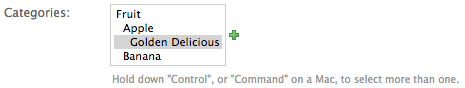

#################
Aldryn Categories
#################

|pypi_version| |build_status| |coverage_status| |codeclimate|

.. |pypi_version| image:: http://img.shields.io/pypi/v/aldryn-categories.svg
   :target: https://pypi.python.org/pypi/aldryn-categories
   :alt: PyPI Version
.. |build_status| image:: https://travis-ci.org/aldryn/aldryn-categories.svg?branch=master
   :target: https://travis-ci.org/aldryn/aldryn-categories/
   :alt: Build Status
.. |coverage_status| image:: http://img.shields.io/coveralls/aldryn/aldryn-categories/master.svg
   :target: https://coveralls.io/r/aldryn/aldryn-categories?branch=master
   :alt: Coverage Status
.. |codeclimate| image:: https://codeclimate.com/github/aldryn/aldryn-categories/badges/gpa.svg
   :target: https://codeclimate.com/github/aldryn/aldryn-categories
   :alt: Code Climate

Description
~~~~~~~~~~~

Aldryn Categories is a simple project that provides hierarchical *categories* as
an independent model in your project. Categories are similar to *tags*, but are
structured into a taxonomy. The project is suitable for I18N projects as
Categories are fully translatable.

Dependencies/Support
~~~~~~~~~~~~~~~~~~~~

1. Python v2.6+
2. Django v1.5.x + South v1.0.2+ (see note below) or Django v1.7+
3. django-treebeard v2.0+
4. django-parler v1.2.1+

If you're using Django <1.7 with South and you cannot upgrade to version 1.0.3
or later, then try adding this to your settings: ::

    MIGRATION_MODULES = {
        …
        'aldryn_categories': 'aldryn_categories.south_migrations',
        …
    }

--------------------
Installation & Usage
--------------------

Aldryn Platform Users
~~~~~~~~~~~~~~~~~~~~~

1) Choose a site you want to install the add-on to from the dashboard.

2) Go to **Apps** -> **Install App**

3) Click **Install** next to **Categories** app.

4) Redeploy the site.

Manual Installation
~~~~~~~~~~~~~~~~~~~

1) Run ``pip install aldryn-categories``.  Or directly from the GitHub
   repository with: ``pip install https://github.com/aldryn/aldryn-categories/archive/master.zip``

2) Add the following to your ``INSTALLED_APPS``: ::

        INSTALLED_APPS = [
            …
            'aldryn_categories',
            'treebeard',
            …
        ]

   Treebeard must be in your INSTALLED_APPS settings in order for the correct
   admin templates to be available.

3) Now, add a `CategoryManyToManyField` to `aldryn_categories.Category` on any
   models you wish to categorize, like so: ::

        # -*- coding: utf-8 -*-

        from django.db import models
        from aldryn_categories.fields import CategoryManyToManyField

        class Thing(models.Model):
            my_field = models.CharField(...)
            ...
            categories = CategoryManyToManyField('aldryn_categories.Category')

This usage of the CategoryManyToManyField simply allows your categories to be
displayed heirarchically in the otherwise normal MultipleSelectWidget like so:

