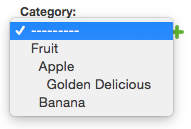

###########
Basic usage
###########

Aldryn Categories is a tool for developers to allow attaching of arbitrary
models to a hierarchical taxonomy of categories.

To use this in your Django project, ensure that this project has been properly
installed, then, add one of these field types to your model:

- ``CategoryManyToManyField``
- ``CategoryOneToOneField``
- ``CategoryForeignKey``

Each acts exactly like the corresponding non-Category Django version with two
differences. First, you won't need to specify the ``to`` argument on the field
declaration as this automatically defaults to ``Category``. Second, each
presents the category choices in a hierarchical manner.

For example, if you would like to "attach" any number of categories to your
``Thing`` model: ::

        # -*- coding: utf-8 -*-

        from django.db import models
        from aldryn_categories.fields import CategoryManyToManyField

        class Thing(models.Model):
            my_field = models.CharField(...)
            ...
            categories = CategoryManyToManyField()

This usage of the ``CategoryManyToManyField`` simply allows your categories to
be displayed hierarchically in the otherwise normal ``MultipleSelectWidget``
like so:

.. image:: images/category-multiple-choice-field.png

Similarly, the ``CategoryModelChoiceField`` provides similar presentation
changes to support the ``CategoryForeignKey`` and ``CategoryOneToOneField``.
For example: ::

        # -*- coding: utf-8 -*-

        from django.db import models
        from aldryn_categories.fields import CategoryForeignKey

        class Thing(models.Model):
            my_field = models.CharField(...)
            ...
            category = CategoryForeignKey()

The widget produced would look like this:

